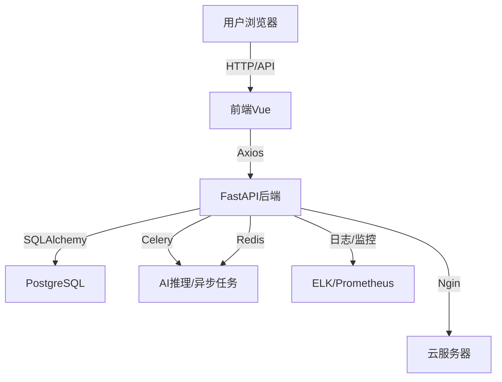

# 第17章：项目实战与综合演练

## 📚 学习目标

通过本章学习，你将：
- 综合运用前16章知识，独立完成全栈AI Web应用开发
- 掌握项目需求分析、架构设计、开发、测试、部署、运维全流程
- 积累真实项目经验，提升工程能力

## 📝 项目需求分析

### 17.1 项目背景
- 以"智能问答平台"为例，用户可注册、登录、提问，AI自动回复，支持历史记录、管理后台

### 17.2 功能模块
- 用户注册/登录/认证
- 智能问答（集成AI模型）
- 历史记录与管理
- 管理员后台（用户/问答管理）
- 日志与监控、性能优化、安全加固

## 🏗️ 架构设计

### 17.3 技术选型
- 后端：FastAPI + SQLAlchemy + Celery + Redis + PostgreSQL
- 前端：Vue3 + Pinia + Vue Router + Axios + Element Plus
- 部署：Docker Compose + Nginx + 云服务器
- 监控：Prometheus + Grafana + ELK/EFK

### 17.4 系统架构图



## 💻 开发与实现

### 17.5 后端实现要点
- 用户认证与权限管理（JWT）
- 问答API（AI模型推理、异步任务）
- 日志、监控、异常处理
- 管理后台API

### 17.6 前端实现要点
- 登录/注册/个人中心页面
- 智能问答主界面（输入、AI回复、历史记录）
- 管理后台页面
- API通信与状态管理

### 17.7 部署与运维
- Dockerfile与Compose一键部署
- Nginx反向代理与HTTPS
- 日志采集与监控报警
- 自动化测试与CI/CD

## 🧩 项目代码结构示例

```
project-root/
├── backend/
│   ├── app/
│   │   ├── main.py
│   │   ├── api/
│   │   ├── models/
│   │   ├── schemas/
│   │   ├── services/
│   │   ├── core/
│   │   └── tasks/
│   ├── requirements.txt
│   └── Dockerfile
├── frontend/
│   ├── src/
│   ├── public/
│   ├── package.json
│   └── Dockerfile
├── deploy/
│   ├── docker-compose.yml
│   └── nginx.conf
├── docs/
│   └── ...
└── README.md
```

## 🏆 项目演练与提升

### 17.8 进阶建议
- 增加AI模型多样性（如LLM、图像识别）
- 支持多用户协作、权限分级
- 接入第三方API（如微信、钉钉、邮件通知）
- 性能与安全专项优化

## ✅ 学习检查表

- [ ] 能独立完成项目需求分析与架构设计
- [ ] 能实现前后端主要功能模块
- [ ] 能编写自动化测试与CI/CD
- [ ] 能部署上线并配置监控与安全
- [ ] 能持续优化与维护项目

## 📝 本章小结

### 重点概念
- ✅ 项目全流程实战
- ✅ 架构设计与技术选型
- ✅ 代码结构与工程实践
- ✅ 部署、监控、安全一体化

### 关键技能
- ✅ 独立开发全栈AI Web应用
- ✅ 项目管理与团队协作
- ✅ 工程化与自动化运维

## 🔗 扩展阅读
- [FastAPI官方文档](https://fastapi.tiangolo.com/)
- [Vue3官方文档](https://vuejs.org/)
- [AI模型集成实践](https://github.com/fastai/fastai)
- [DevOps最佳实践](https://devops.com/)

## ❓ 常见问题

**Q: 项目实战遇到难题怎么办？**
A: 拆解问题、查阅文档、善用社区、团队协作、持续学习。 