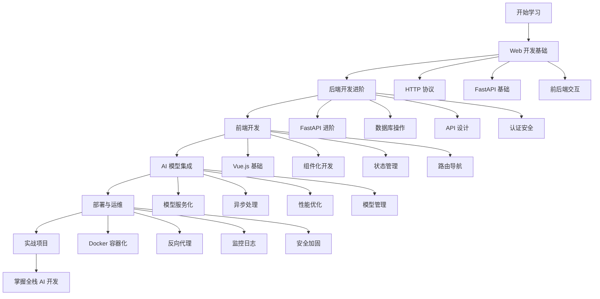

# 学习路线图

## 🗺️ 整体路线图

## 📚 详细学习路径

### 第一阶段：Web 开发基础 (2-3 天)

#### 目标
- 理解 Web 开发的基本概念
- 掌握 FastAPI 框架的基础用法
- 学会前后端数据交互

#### 学习内容
1. **HTTP 协议基础**
   - HTTP 请求/响应结构
   - 状态码和头部信息
   - RESTful API 设计原则

2. **Web 框架入门**
   - FastAPI 安装和配置
   - 路由和请求处理
   - 参数验证和类型提示

3. **前后端交互**
   - JSON 数据格式
   - API 调用方法
   - 错误处理机制

4. **实践项目**
   - 构建简单的 API 服务
   - 实现基础的 CRUD 操作

#### 学习资源
- [FastAPI 官方教程](https://fastapi.tiangolo.com/tutorial/)
- [HTTP 协议详解](https://developer.mozilla.org/zh-CN/docs/Web/HTTP)
- [RESTful API 设计指南](https://restfulapi.net/)

### 第二阶段：后端开发进阶 (3-4 天)

#### 目标
- 深入学习 FastAPI 高级特性
- 掌握数据库操作和 ORM
- 实现完整的后端服务

#### 学习内容
1. **FastAPI 进阶**
   - 依赖注入系统
   - 中间件和异常处理
   - 后台任务和 WebSocket

2. **数据库操作**
   - SQLAlchemy ORM
   - 数据库设计和迁移
   - 查询优化和性能调优

3. **API 设计**
   - RESTful API 最佳实践
   - API 文档自动生成
   - 版本控制和兼容性

4. **认证与安全**
   - JWT 令牌认证
   - 权限控制和角色管理
   - 安全防护措施

#### 学习资源
- [SQLAlchemy 文档](https://docs.sqlalchemy.org/)
- [JWT 认证指南](https://jwt.io/introduction)
- [API 安全最佳实践](https://owasp.org/www-project-api-security/)

### 第三阶段：前端开发 (3-4 天)

#### 目标
- 掌握 Vue.js 框架开发
- 学会组件化开发思想
- 构建现代化用户界面

#### 学习内容
1. **Vue.js 基础**
   - 响应式数据绑定
   - 生命周期钩子
   - 模板语法和指令

2. **组件化开发**
   - 组件设计和封装
   - Props 和事件通信
   - 插槽和组合式 API

3. **状态管理**
   - Pinia 状态管理
   - 状态持久化
   - 异步状态处理

4. **路由和导航**
   - Vue Router 配置
   - 路由守卫和权限
   - 懒加载和代码分割

#### 学习资源
- [Vue.js 官方文档](https://vuejs.org/guide/)
- [Pinia 状态管理](https://pinia.vuejs.org/)
- [Vue Router 路由管理](https://router.vuejs.org/)

### 第四阶段：AI 模型集成 (2-3 天)

#### 目标
- 学会集成 AI 模型到 Web 应用
- 掌握异步任务处理
- 优化 AI 服务性能

#### 学习内容
1. **模型服务化**
   - OpenAI API 集成
   - 模型封装和抽象
   - 错误处理和重试机制

2. **异步处理**
   - 后台任务队列
   - WebSocket 实时通信
   - 进度跟踪和状态更新

3. **性能优化**
   - 缓存策略
   - 并发控制
   - 响应时间优化

4. **模型管理**
   - 多模型版本管理
   - A/B 测试支持
   - 模型监控和评估

#### 学习资源
- [OpenAI API 文档](https://platform.openai.com/docs)
- [Celery 任务队列](https://docs.celeryproject.org/)
- [Redis 缓存系统](https://redis.io/documentation)

### 第五阶段：部署与运维 (2-3 天)

#### 目标
- 掌握容器化部署技术
- 学会生产环境配置
- 实现监控和日志管理

#### 学习内容
1. **Docker 容器化**
   - Docker 镜像构建
   - 多阶段构建优化
   - Docker Compose 编排

2. **反向代理**
   - Nginx 配置和优化
   - 负载均衡策略
   - SSL 证书配置

3. **监控与日志**
   - 应用性能监控
   - 日志收集和分析
   - 告警和通知机制

4. **安全加固**
   - 网络安全配置
   - 数据加密和备份
   - 访问控制和审计

#### 学习资源
- [Docker 官方文档](https://docs.docker.com/)
- [Nginx 配置指南](https://nginx.org/en/docs/)
- [Prometheus 监控系统](https://prometheus.io/docs/)

### 第六阶段：实战项目 (4-5 天)

#### 目标
- 综合运用所学知识
- 完成完整的全栈项目
- 掌握项目开发流程

#### 学习内容
1. **项目架构设计**
   - 系统架构规划
   - 技术选型和评估
   - 开发环境搭建

2. **开发流程管理**
   - 需求分析和设计
   - 代码版本控制
   - 测试和调试策略

3. **部署上线**
   - 生产环境部署
   - 性能测试和优化
   - 运维和监控

4. **项目总结**
   - 技术难点总结
   - 经验教训分享
   - 后续优化方向

## 🎯 学习建议

### 时间安排
- **每日学习时间**: 2-4 小时
- **理论学习**: 30% 时间
- **实践练习**: 70% 时间
- **项目实战**: 最后阶段集中进行

### 学习方法
1. **循序渐进**: 按章节顺序学习，打好基础
2. **动手实践**: 每学一个概念都要动手编码
3. **项目驱动**: 以完成项目为目标进行学习
4. **及时复习**: 定期回顾和巩固知识点

### 学习资源
- **官方文档**: 优先阅读官方文档
- **视频教程**: 配合视频学习加深理解
- **开源项目**: 参考优秀开源项目代码
- **技术社区**: 参与技术讨论和问答

## 📈 技能评估

### 初级水平
- [x] 能够搭建基础的 Web 应用
- [x] 理解前后端分离架构
- [x] 掌握基本的 API 开发

### 中级水平
- [x] 能够设计完整的系统架构
- [x] 熟练使用各种开发工具
- [x] 具备问题排查和解决能力

### 高级水平
- [x] 能够优化系统性能
- [x] 掌握生产环境部署
- [x] 具备技术选型和架构设计能力

## 🚀 进阶方向

### 技术深化
- **微服务架构**: 学习服务拆分和治理
- **云原生技术**: 掌握 Kubernetes 和云服务
- **DevOps 实践**: 自动化部署和运维

### 领域扩展
- **移动端开发**: React Native 或 Flutter
- **大数据处理**: Spark 和数据处理管道
- **机器学习**: 深度学习模型训练和部署

### 职业发展
- **技术管理**: 团队管理和技术决策
- **架构设计**: 系统架构和技术选型
- **技术咨询**: 技术方案设计和实施

**记住：学习是一个持续的过程，保持好奇心和学习的热情！** 🌟 